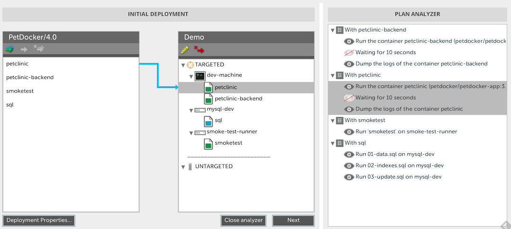

# Overview #

The Docker plugin is a XL Deploy plugin that adds capability for deploying applications to a Docker container.

# Installation #

Place the plugin JAR file into your `SERVER_HOME/plugins` directory.

# Sample Application PetDocker #
1. Go to the PetDocker folder
2. Run the package.sh script with a version `./package.sh 3.5`
3. Import the created dar in XLD

# Set up an Environment #
1. Create new Docker Machine using the virtualbox provider `docker-machine create --driver virtualbox dev-machine`
2. Run `docker-machine env dev-machine` to get information about it

```
export DOCKER_TLS_VERIFY=yes
export DOCKER_CERT_PATH=/Users/bmoussaud/.docker/machine/machines/dev-machine
export DOCKER_HOST=tcp://192.168.99.100:2376
```

3. In XL Deploy, Create new CI `dev-machine` of type `docker.Machine` with the following properties
   * id: Infrastructure/dev-machine/mysql-dev
   * type: docker.Machine
   * Port: 2376
   * Private Key File: /Users/bmoussaud/.docker/machine/machines/dev-machine
   * username: docker
   * address: localhost

4. Run a new MySql Docker Container: `docker run --name mysql-dev -e MYSQL_ROOT_PASSWORD=deployit -d mysql:5.7.6`
5. Add it in XLD
    * id: Infrastructure/dev-machine/mysql-dev
    * type: sql.DockerMySqlClient
    * image: mysql:5.7.6
    * username: root
    * password: deployit
6. Add a new CI
    * id: Infrastructure/dev-machine/smoke-test-runner
    * type: smoketest.DockerRunner
    * image: cmfatih/ubuntu
    * Volume Directory: /opt/docker/volumes

4. Add the created CIs in your environment.




# TODO #

* docker.Volume linked with docker.DeployedFolderVolume
* Manage Volume modification -> stop / start container.

# Start the Software Factory
The Software Factory contains a Jenkins and a Docker Registry
In the `Environments` directory run
* docker-compose -f  software-factory.yml  build
* docker-compose -f  software-factory.yml  up

# Set up a docker registry
on your docker machine
* docker-machine ssh <machine>
* sudo vi /var/lib/boot2docker/profile
Add `EXTRA_ARGS='--insecure-registry <IP_MACHINE>:5000` to the EXTRA_ARGS line
* exit
* docker-machine stop <machine>
* docker-machine start <machine>
* docker log file is located here: tail -f /var/log/docker.log

# Jenkins PetPortal Job
* Adminstration Jenkin: define a default Maven location.
* Adminstration Jenkin: define the XLD Configuration using
  http://10.0.2.2:4516 (super host address when using VirtualBox)

* Maven Job PetDocker
* Git : https://github.com/bmoussaud/xld-petclinic-tomcat.git
* Branch: docker
* Build: clean package
* Commands after build
```
cp ${WORKSPACE}/PetClinic/target/PetClinic.war $WORKSPACE/docker/petclinic/PetClinic.war
cp ${WORKSPACE}/PetClinic-Backend/target/PetClinic-Backend.war $WORKSPACE/docker/petclinic-backend/PetClinic-Backend.war
```

```
/usr/bin/docker build -t 192.168.99.100:5000/petportal/petclinic:$BUILD_NUMBER $WORKSPACE/docker/petclinic
/usr/bin/docker build -t 192.168.99.100:5000/petportal/petclinic-back:$BUILD_NUMBER $WORKSPACE/docker/petclinic-backend
```

```
/usr/bin/docker push 192.168.99.100:5000/petportal/petclinic:$BUILD_NUMBER
/usr/bin/docker push 192.168.99.100:5000/petportal/petclinic-back:$BUILD_NUMBER
```

Note: Replace 192.168.99.100 by your <IP_DOCKER_MACHINE>

  * cp ${WORKSPACE}/PetClinic/target/PetClinic.war $WORKSPACE/docker/petclinic/PetClinic.war
  * /usr/bin/docker build -t petdocker/petdocker-app:$BUILD_NUMBER $WORKSPACE/docker/petclinic
  * /usr/bin/docker tag petdocker/petdocker-app:$BUILD_NUMBER  <IP_MACHINE>:5000/petdocker/petdocker-app:$BUILD_NUMBER 
  * /usr/bin/docker push <IP_MACHINE>:5000/petdocker/petdocker-app:$BUILD_NUMBER 
 
docker run -p 5000:5000 registry
test registry http://192.168.99.100:5000/v1/search
Notes: 
* http://www.activestate.com/blog/2014/01/deploying-your-own-private-docker-registry
* ..

# NEW SETUP #

1. Create a new Cloud Template `registry template` in new Env called `SF`
* (optional)Add a smoke test runner 
2. Deploy `Registry/2.0` to env 


